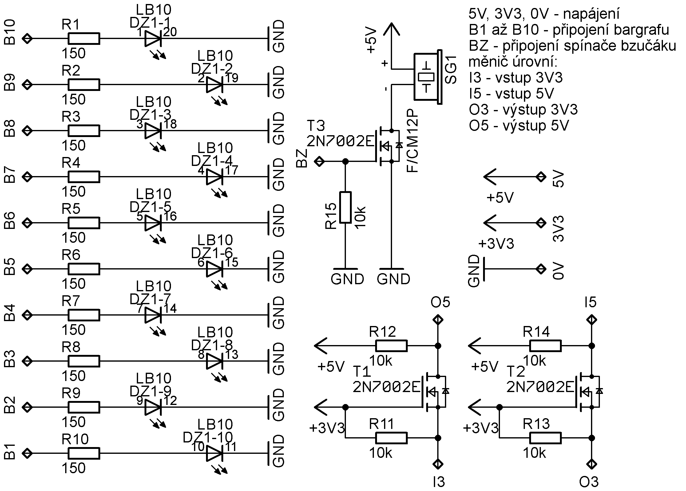

# Parkovací asistent
[Odkaz na GitHub](https://github.com/Dan5049/DE1-project)

### Členové týmu
Fabula Boris      [GitHub](https://github.com/bfbl/Digital-electronics-1)  
Havránek Daniel   [GitHub](https://github.com/Dan5049/Digital-electronics-1)   
Hlaváček Jakub    [GitHub](https://github.com/Jakubhl/Digital-electronics-1)   
Horna Aleš        [GitHub](https://github.com/xhorna16/Digital-electronics-1)

### Cíl projektu
<br>

* Cílem projektu je vytvoření parkovacího asistentu. Základní verze obsahuje jeden ultrazvukový senzor HC-SR04, bargrafem realizovaným pomocí LED integrovaných na desce a zvukuvou signalizací pomocí bzučáku.
* V druhé verzi projektu je plánováno nahradit LED optickou signalizaci externího bargrafu.
* V třetí verzi projektu je plánováno použití třech ultrazvukových senzorů namísto jednoho. Pro optickou signalizaci bude za potřebí využít třech bargrafů - každý pro jeden senzor. Zvuková signalizace pomocí bzučáku bude poté pro nejkritičtejší hodnotu.


## Popis hardwaru
### Blokové schéma


<br>

Na blokovém schématu můžeme vidět princip fungování. *Clock generator* nám generuje hodinový signál o frekvenci 100MHz, který je přiváděn do bloku *Trigger generator* a *Distance counter*. Další vstup do obou bloků je *reset*. 

Blok *Trigger generator* generuje řídící signál pro senzor *HC-SR04*. Tento signál je 10μs v hodnotě 1 a poté v hodnotě 0. Perioda tohoto signálu je 100ms.

Výstup ze senzoru *HC-SR04* je přiváděn do bloku *Distance counter* jako signál *echo*. Podle délky tohoto signálu je zjištěna vzdálenost od objektu. Podle vzdálenosti od objektu se rozsvítí určitý počet LED a nastaví se délka pípání bzučáku.

<br>

### DPS
#### Schéma zapojení přídavné desky

#### Náhled desky


<br>

Blok optické a akustické signalisace
* bargraf s 10 LED se spojenými katodami je přes předřadné odpory připojen na příslušné výstupy FPGA
* samokmitající bzučák, napájený z 5V, je spínán tranzistorem MOSFET, ovládaným z výstupu FPGA
* dále jsou obsaženy dva převodníky úrovní mezi 3,3V a 5V využité pro komunikaci mezi FPGA a ultrazvukovým snímačem
Převodníky úrovní
* řeší problém odlišných napětí odpovídajících logickým úrovním 1 na hlavní desce (s FPGA) a ultrazvukovém snímači
* jako zdroje napětí 3,3V a 5V použijí se příslušné výstupy na hlavní desce
* přenáší úroveň z jedné strany na druhou činností tranzistoru MOSFET
* vstup pro úroveň s určitým napětím označen jako I3, resp. I5, podle napětí
* výstup pro úroveň s určitým napětím označen jako O3, resp. O5, podle napětí
* vysvětlení funkce na příkladu:
	* na I3 je úroveň log. 0 (0V), T1 je otevřen (UGS=3,3V), úroveň 0 se tak přenese na výstup O5, kde bude napětí blízké nule (T1 otevřen)
	* na I3 je úroveň log. 1 (3,3V), T1 je uzavřen (UGS=0V), úroveň 1 se tak přenese na výstup O5, kde bude napětí 5V (T1 uzavřen)
	* funkce druhého převodníku je analogická
Praktické provedení
* většina součástek v provedení SMD, odpory-1206, tranzistory-SOT23, přesné informace v souboru "seznam-soucastek.txt"
* tranzistory jsou MOSFET, typ 2N7002, prahové napětí UGSth, povolený proud ID a další parametry jsou postačující
* jednostranná DPS, připojení k hlavní desce realisuje se pomocí páskových vodičů pájených do DPS bloku signalisace, na straně desky s FPGA připojeny pomocí vhodného konektoru
* na DPS vyznačena místa pro vyvrtání otvorů pro eventuální uchycení 4 šrouby M3
* bargraf může být osazen do patice DIL, což usnadní případnou výměnu za jiný typ (jiná barva světla)

Seznam součástek a osazovací plány na desku jsou na gitu ve složce *eagle*, popřípadě ve složce *images*

## VHDL moduly a simulace
### Modul *trigger*
``` VHDL
library ieee;               -- Standard library
use ieee.std_logic_1164.all;-- Package for data types and logic operations
use ieee.numeric_std.all;   -- Package for arithmetic operations

entity trigger is
port(
    clk     : in std_logic;    --clock
    rst     : in std_logic;    --reset
    trig_o  : out std_logic);  --trigger signal to sonar
end entity trigger;

architecture Behavioral of trigger is 
    signal s_tick     : integer; --time counter, one tick is 10ns
begin

    p_trigger : process(clk)is
    begin
        if rising_edge(clk) then
            if rst = '1' then                                       --if reset is 1, set trigger and time counter to 0
                trig_o <= '0'; 
                s_tick <= 0;           
            else
                if (s_tick <= 1000) then                            --set trrigger to 1 for time equal to 1000 ticks (10us)
                    trig_o <= '1';
                    s_tick <= s_tick + 1;
                elsif (s_tick < 10000000 and s_tick >= 1000) then   --set trigger to 0 for the rest of the time of 100ms
                    s_tick <= s_tick + 1;
                    trig_o <= '0';
                else 
                    s_tick <= 0;                                    --reset time counting
                end if;
           end if;
       end if;
    end process p_trigger;
end architecture Behavioral;
```
Modul *trigger* slouží ke generování budícího signálu *trig_o* pro senzor *HC-SR04*. Pokud je *reset* v hodnotě 1, budící signál *trig_o* je nastavený na hodnotu 0. V opačném případě se počítá počet nástupných hran hodinového signálu *clk* a ukládá se do pomocného signálu *s_tick*. Podle hodnoty pomocného signálu *s_tick* se nastavuje hodnota budícího signálu *trig_o* do hodnoty 0 nebo 1.

Hodnota uložená v pomocném signálu *s_tick* je čas v desítkách nanosekund. Pokud je hodnota pomocného signálu *s_tick* menší než 1000 (10μs), tak je nastavena hodnota budícího signálu *s_trig* na hodnotu 1. V opačném případě je nastavena na hodnotu 0. Pokud je hodnota pomocného signálu *s_tick* větší než 10000000 (100ms), tak dojde k vynulování pomocného signálu *s_tick*.

#### Simulace triggru


<br>

### Modul *dist*
``` VHDL
library ieee;               -- Standard library
use ieee.std_logic_1164.all;-- Package for data types and logic operations
use ieee.numeric_std.all;   -- Package for arithmetic operations

entity dist is
port(
    clk       : in std_logic;
    rst       : in std_logic;
    echo_i    : in std_logic;  --input from sonar
    buzz_o    : out std_logic; --output to buzzer
    leds_o    : out std_logic_vector (10 - 1 downto 0));
end entity dist;

architecture Behavioral of dist is 
    signal s_tick     : integer; --auxiliary variable for time counting
    signal s_dist     : integer; --auxiliary variable for distance counting
    signal s_tock     : integer; --auxiliary variable for time counting
    signal s_tock_on  : integer; --duty cycle for PWM signal to buzzer
    signal s_tock_off : integer; --period of the PWM signal
    signal s_xyz      : std_logic := '1'; --echo rising edge detection signal
begin

    p_distance : process(clk, echo_i)is --measure distance 
    begin
        if rising_edge(clk) then
            if rst = '1' then
                s_dist <= 1000; -- if dist = 1000 - error value (10m - more than it's able to measure)
                s_tick <= 0;
            else
                if echo_i = '1' then -- if echo is on 1, start counting time
                    s_tick <= s_tick +1; 
                    s_dist <= s_tick /(100*58); --conversion of ticks to distnace
                else
                    s_tick <= 0;
                end if;
            end if;
        end if;
    end process p_distance;
    
    p_bargraf : process (echo_i, s_dist, s_xyz)  --set the number of leds and duty cycle of buzzer
    begin
        if s_dist > 400 then
            leds_o <= "0000000000";
            s_tock_on <= 0;
            s_tock_off <= 100000000;
        end if; 
        if s_xyz = '1' and echo_i = '0' then
            if (s_dist <= 400 and s_dist >= 150) then --distance 4m to 1.5m
                leds_o <= "0000000001";
                s_tock_on <= 3000000;
                s_tock_off <= 10000000;
            elsif (s_dist < 150 and s_dist >= 100) then --distance 1.5m to 1m
                leds_o <= "0000000011";
                s_tock_on <= 3500000;
                s_tock_off <= 10000000;
            elsif (s_dist < 100 and s_dist >= 80) then --distance 1m to 0.8m
                leds_o <= "0000000111";
                s_tock_on <= 4000000;
                s_tock_off <= 10000000;
            elsif (s_dist < 80 and s_dist >= 70) then --distance 0.8m to 0.7m
                leds_o <= "0000001111";
                s_tock_on <= 4500000;
                s_tock_off <= 10000000; 
            elsif (s_dist < 70 and s_dist >= 60) then --distance 0.7m to 0.6m
                leds_o <= "0000011111";
                s_tock_on <= 5000000;
                s_tock_off <= 10000000;
            elsif (s_dist < 60 and s_dist >= 50) then --distance 0.6m to 0.5m
                leds_o <= "0000111111";
                s_tock_on <= 6000000;
                s_tock_off <= 10000000;
            elsif (s_dist < 50 and s_dist >= 40) then --distance 0.5m to 0.4m
                leds_o <= "0001111111";
                s_tock_on <= 7000000;
                s_tock_off <= 10000000;
            elsif (s_dist < 40 and s_dist >= 35) then --distance 0.4m to 0.35m
                leds_o <= "0011111111";
                s_tock_on <= 8000000;
                s_tock_off <= 10000000;
            elsif (s_dist < 35 and s_dist >= 30) then --distance 0.35m to 0.3m
                leds_o <= "0111111111";
                s_tock_on <= 9000000;
                s_tock_off <= 10000000;
            elsif s_dist < 30 then                      --distance less than 0.3m
                leds_o <= "1111111111";
                s_tock_on <= 3000000;
                s_tock_off <= 0;
            else
                leds_o <= "0000000000";
                s_tock_on <= 0;
                s_tock_off <= 100000000;
            end if;
       end if;
       s_xyz <= echo_i;    
    end process p_bargraf;
    
    p_buzz : process(clk, s_tock, s_tock_on, s_tock_off, echo_i)is
    begin                           -- controll buzzer based on the duty cycle values from p_bargraf
        if rising_edge(clk) then
            if rst = '1' then
                buzz_o <= '0';
                s_tock <= 0;
            else                
                if (s_tock <= s_tock_on) then
                    buzz_o <= '1';
                    s_tock <= s_tock + 1;
                elsif (s_tock <= s_tock_off and s_tock >= s_tock_on) then
                    buzz_o <= '0';
                    s_tock <= s_tock + 1;
                else 
                    s_tock <= 0;
                end if;
            end if;
        end if;    
    end process p_buzz;
    
end architecture Behavioral;
```
Modul *dist* slouží k získání hodnoty vzdálenosti od objektu a následému ovládání výstupních signalizací. Skládá se ze tří procesů: *p_distance*, *p_bargraf* a *p_buzz*.

Proces *p_distance* měří délku signálu *echo_i* přicházejícího ze senzoru *HC-SR04*. Stejně jak v modulu *trigger* se měří délka signálu *echo_i* na základě počtu náběžných hran hodinového signálu *clk*. Pokud je tedy hodnota signálu *echo_i* v hodnotě 1, počítá se počet náběžných hran signálu *clk* a ukládá se do pomocného signálu *s_tick*, který je stejně jak předtím v desítkách nanosekudn. Pokud je reset v hodnotě 1, dojde k vyresetování celého procesu a vzdálenost, uložená v pomocném signálu *s_dist*, se nastaví na hodnotu 10000. Tato hodnota odpovídá vzdálenosti 10m, což je hodnota vyšší, než je senzor schopen měřit - errorová hodnota. Jinak dochází k přepočtu délky signálu *echo_i* na vzdálenost, která se následně ukládá do pomocného signálu *s_dist*. Přepočet je uveden v datasheetu k senzoru *HC-SR04* - čas v mikrosekudnách děleno 58 je roven vzdálenosti v centimetrech.

V procesu *p_bargraf* dochází k zapnutí určitého počtu LED, v závislosti na vzdálenosti (hodnota signálu *s_dist*). Počet rozsvícených LED není přímo úměrný vzdálenosti - pro větší vzdálenosti je odstup mezi jednotlivými LED větší než pro kratší vzdálenosti. Všechny LED svítí při vzdálenosti menší 30cm. Také se v tomto procesu nastavuje střída a perioda pro signál *s_buzz*, který spouští zvukovou signalizaci. Perioda signálu *s_buzz* je 100ms, střída se mění v závislosti na vzdálenosti a nastavuje se spolu s LED.

V procesu *p_buzz* dochází ke generování signálu pro zvukovou signalizaci *s_buzz* v závisloti na hodnotách získaných v předchozím procesu. Pokud je vzdálenost od objektu menší než 30cm, je signál *s_buzz* nastaven na hodnotu 1 a nemění se. Čím je vzdálenost větší, tím kratší dobu je signál *s_buzz* nastaven na hodnotu 1.

Ve složce *buzzer* je kód v matlabu, kterým jsme zjištovali minimální slyšitelnou délku pulzu. Z toho důvodu jsme se rozhodli nastavit nejkratší použitou časovou délku pulzu na 30ms.

#### Tabulka nastavení počtu LED a střídy bzučáku
| Vzdálenost [cm] | Počet LED | Střída [%] |
|:-:|:-:|:-:|
| nad 400 | 0 | 0 | 0 |
| 150 až 400 | 1 | 30 |
| 100 až 150 | 2 | 35 |
|  80 až 100 | 3 | 40 |
|  70 až  80 | 4 | 45 |
|  60 až  70 | 5 | 50 |
|  50 až  60 | 6 | 60 |
|  40 až  50 | 7 | 70 |
|  35 až  40 | 8 | 80 |
|  30 až  35 | 9 | 90 |
|  pod  30 | 10 | 100 |

<br>

#### Průběh simulace LED


<br>

#### Průběhy simulace bzučáku


## TOP modul a simulace


### Top modul kód
```VHDL
----------------------------------------------------------------------------------
-- Company: 
-- Engineer: 
-- 
-- Create Date: 20.04.2021 21:44:59
-- Design Name: 
-- Module Name: top - Behavioral
-- Project Name: 
-- Target Devices: 
-- Tool Versions: 
-- Description: 
-- 
-- Dependencies: 
-- 
-- Revision:
-- Revision 0.01 - File Created
-- Additional Comments:
-- 
----------------------------------------------------------------------------------


library IEEE;
use IEEE.STD_LOGIC_1164.ALL;

-- Uncomment the following library declaration if using
-- arithmetic functions with Signed or Unsigned values
--use IEEE.NUMERIC_STD.ALL;

-- Uncomment the following library declaration if instantiating
-- any Xilinx leaf cells in this code.
--library UNISIM;
--use UNISIM.VComponents.all;

entity top is
    port ( 
        CLK100MHZ   : in std_logic;
        btn         : in std_logic_vector (1 - 1 downto 0);
        ja          : out std_logic_vector(8 - 1 downto 0);
        jb          : out std_logic_vector (4 - 1 downto 0);
        jc          : in std_logic_vector(1 - 1 downto 0));
end top;

architecture Behavioral of top is
--no internal signals
begin
    
    trigger_top : entity work.trigger
        port map (
            clk         => CLK100MHZ,
            rst         => btn(0),
            trig_o      => ja(0));
            
    dist_top    : entity work.dist
        port map (
            clk                     => CLK100MHZ,
            rst                     => btn(0),  
            buzz_o                  => ja(1), 
            leds_o(6 - 1 downto 0)  => ja(8 - 1 downto 2),
            leds_o(10 - 1 downto 6) => jb(4 - 1 downto 0),
            echo_i                  => jc(0)); 
end Behavioral;
``` 

### Tabulka propojení
| **Signál**| **Výstupní pin** | **FPGA pin** | **FPGA package pin** |
| :-: | :-: | :-: | :-: |
| rst | btn[0] | IO_L6N_T0_VREF_16 | D9 |
| echo_i | jc[0] | IO_L20P_T3_A08_D24_14 | U12 |
| trig_o | ja[0] | IO_0_15 | G13 |
| buzz_o | ja[1] | IO_L4P_T0_15 | B11 |

<br>

### Tabulka propojení bragrafu
| **Signál -> leds_o**| **Výstupní pin** | **FPGA pin** | **FPGA package pin** |
| :-: | :-: | :-: | :-: |
| 0 | ja[2] | IO_L4N_T0_15 | A11 |
| 1 | ja[3] | IO_L6P_T0_15 | D12 |
| 2 | ja[4] | IO_L6N_T0_VREF_15 | D13 |
| 3 | ja[5] | IO_L10P_T1_AD11P_15 | B18 |
| 4 | ja[6] | IO_L10N_T1_AD11N_15 | A18 |
| 5 | ja[7] | IO_25_15 | K16 |
| 6 | jb[0] | IO_L11P_T1_SRCC_15 | E15 |
| 7 | jb[1] | IO_L11N_T1_SRCC_15 | E16 |
| 8 | jb[2] | IO_L12P_T1_MRCC_15 | D15 |
| 9 | jb[3] | IO_L12N_T1_MRCC_15 | C15 |

<br>

### Simulace topu


## Dosažené cíle
Povedlo se vytvořit parkovacího asistenta s jedním ultrazvukovým senzorem, zvukovou signalizací pomocí bzučáku a optickou signalizací pomocí bargrafu. Generování *triggrovacího* signálu a optická signalizace funguje bez problému. Při generování signálu pro bzučák se na počátku prvního *echa* oběví krátký pulz. Tento pulz je nechtěný, ale je tak krátky, že ho člověk není schopen zaregistrovat.

Projekt by se dal rozšířit přidáním dalších dvou ultrazvukových senzorů a bargrafů. Také by pro praktické použití na autě bylo vhodné vybrat jiný senzor (odolnější proti povětrnostním a pracovním podmínkám).

Projekt jsme také realizovali pomocí desky Arduino, stejného senzoru HC-SR04, bzučáku a čtyř ledek namísto bargrafu.

## Video
[Prezentacia projektu](https://drive.google.com/file/d/18ILoBno3hiMNqDnNoh6uOZaAPErlnejO/view?usp=sharing)
  
[Prezentacia na Arduine](https://drive.google.com/file/d/1YwLW6wj0uFljxe86JlJZtg1215zJ4bRm/view?usp=sharing)


## Reference
1. https://github.com/Digilent/digilent-xdc/blob/master/Arty-A7-100-Master.xdc
2. https://www.electroschematics.com/wp-content/uploads/2013/07/HCSR04-datasheet-version-1.pdf
3. https://github.com/tomas-fryza/Digital-electronics-1
4. https://app.diagrams.net/
5. https://vhdlwhiz.com/basic-vhdl-tutorials/
