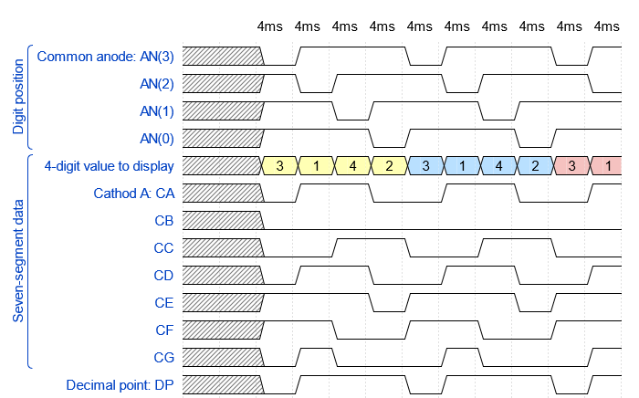

## Timing diagram
```
{
  signal:
  [
    ['Digit position',
      {name: 'Common anode: AN(3)', wave: 'xx01..01..01'},
      {name: 'AN(2)', wave: 'xx101..01..0'},
      {name: 'AN(1)', wave: 'xx1.01..01..'},
      {name: 'AN(0)', wave: 'xx1..01..01.'},
    ],
    ['Seven-segment data',
      {name: '4-digit value to display', wave: 'xx3333555599', data: ['3','1','4','2','3','1','4','2','3','1']},
      {name: 'Cathod A: CA', wave: 'xx01.0.1.0.1'},
      {name: 'CB', wave: 'xx0.........'},
      {name: 'CC', wave: 'xx0.1.0.1.0.'},
      {name: 'CD', wave: 'xx01.0.1.0.1'},
      {name: 'CE', wave: 'xx1..01..01.'},
      {name: 'CF', wave: 'xx1.0.1.0.1.'},
      {name: 'CG', wave: 'xx010..10..1'},
    ],
    {name: 'Decimal point: DP', wave: 'xx01..01..01'},
  ],
  head:
  {
    text: '                    4ms   4ms   4ms   4ms   4ms   4ms   4ms   4ms   4ms   4ms',
  },
}
```

## MUX
```vhdl
p_mux : process(s_cnt, data0_i, data1_i, data2_i, data3_i, dp_i)
    begin
        case s_cnt is
            when "11" =>
                s_hex <= data3_i;
                dp_o  <= dp_i(3);
                dig_o <= "0111";

            when "10" =>
                -- WRITE YOUR CODE HERE
                s_hex <= data2_i;
                dp_o  <= dp_i(2);
                dig_o <= "1011";
            when "01" =>
                -- WRITE YOUR CODE HERE
                s_hex <= data1_i;
                dp_o  <= dp_i(1);
                dig_o <= "1101";
            when others =>
                -- WRITE YOUR CODE HERE
                s_hex <= data0_i;
                dp_o  <= dp_i(0);
                dig_o <= "1110";
        end case;
    end process p_mux;
```
## testbench
```vhdl
------------------------------------------------------------------------
--
-- Template for 4-digit 7-segment display driver testbench.
-- Nexys A7-50T, Vivado v2020.1.1, EDA Playground
--
-- Copyright (c) 2020-Present Tomas Fryza
-- Dept. of Radio Electronics, Brno University of Technology, Czechia
-- This work is licensed under the terms of the MIT license.
--
------------------------------------------------------------------------

library ieee;
use ieee.std_logic_1164.all;

------------------------------------------------------------------------
-- Entity declaration for testbench
------------------------------------------------------------------------
entity tb_driver_7seg_4digits is
    -- Entity of testbench is always empty
end entity tb_driver_7seg_4digits;

------------------------------------------------------------------------
-- Architecture body for testbench
------------------------------------------------------------------------
architecture testbench of tb_driver_7seg_4digits is

    -- Local constants
    constant c_CLK_100MHZ_PERIOD : time    := 10 ns;

    --Local signals
    signal s_clk_100MHz : std_logic;
    signal s_reset      : std_logic;
    signal s_data3_i    : std_logic_vector(3 downto 0);
    signal s_data2_i    : std_logic_vector(3 downto 0);
    signal s_data1_i    : std_logic_vector(3 downto 0);
    signal s_data0_i    : std_logic_vector(3 downto 0);
    signal s_dp_i       : std_logic_vector(3 downto 0);
    signal s_dp_o       : std_logic;    
    signal s_seg_o      : std_logic_vector(6 downto 0);    
    signal s_dig_o      : std_logic_vector(3 downto 0);

begin
    -- Connecting testbench signals with driver_7seg_4digits entity
    -- (Unit Under Test)
    --- WRITE YOUR CODE HERE
    uut_driver_7seg_4digits : entity work.driver_7seg_4digits
    port map(
        clk => s_clk_100MHz,
        reset => s_reset,  
        data3_i => s_data3_i,
        data2_i => s_data2_i,
        data1_i => s_data1_i,
        data0_i => s_data0_i,                
        dp_i => s_dp_i,   
        dp_o => s_dp_o,   
        seg_o => s_seg_o,  
        dig_o => s_dig_o
        );  
    --------------------------------------------------------------------
    -- Clock generation process
    --------------------------------------------------------------------
    p_clk_gen : process
    begin
        while now < 750 ns loop         -- 75 periods of 100MHz clock
            s_clk_100MHz <= '0';
            wait for c_CLK_100MHZ_PERIOD / 2;
            s_clk_100MHz <= '1';
            wait for c_CLK_100MHZ_PERIOD / 2;
        end loop;
        wait;
    end process p_clk_gen;

    --------------------------------------------------------------------
    -- Reset generation process
    --------------------------------------------------------------------
    --- WRITE YOUR CODE HERE
    p_reset_gen : process
        begin
            s_reset <= '0';
            wait for 10 ns;
            s_reset <= '1';   
            wait for 50 ns;
            s_reset <= '0';
            wait;
        end process p_reset_gen;
    --------------------------------------------------------------------
    -- Data generation process
    --------------------------------------------------------------------
    --- WRITE YOUR CODE HERE
        p_stimulus: process
        begin
        -- Report a note at the begining of stimulus process
            report "Stimulus process started." severity note;        
            s_data3_i   <= "0011";
            s_data2_i   <= "0001";
            s_data1_i   <= "0100";
            s_data0_i   <= "0010";
            s_dp_i  <= "0111";        
            wait for 500 us;
            assert(s_seg_o = "0010010")
            report "Error - 1st digit." severity note;        
            wait for 4 ms;   
            assert(s_seg_o = "1001100")
            report "Error - 2nd digit." severity note;   
            wait for 4 ms;   
            assert(s_seg_o = "1001111")
            report "Error - 3rd digit." severity note;       
            wait for 4 ms;   
            assert(s_dp_o = '0')
            report "Error - DP." severity note;
            assert(s_seg_o = "0000110")
            report "Error - 4th digit." severity note;
            report "Stimulus process finished." severity note;
        wait;
    end process p_stimulus;
end architecture testbench;
```
## simulation
