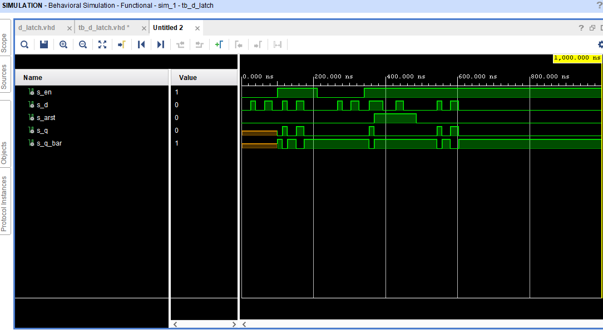
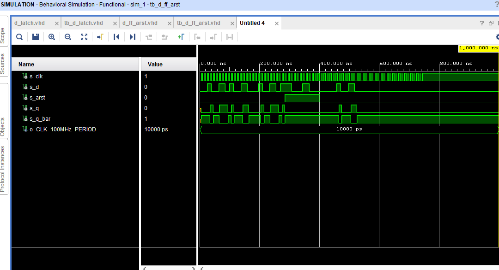
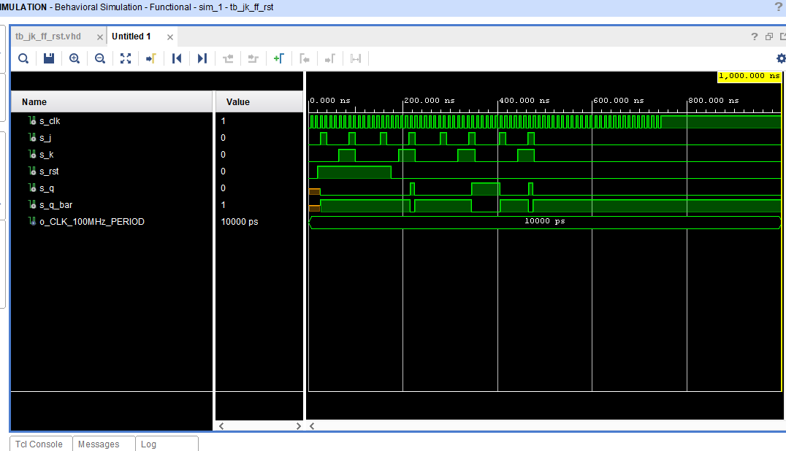
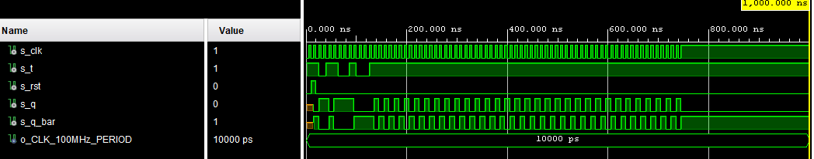

```
D:  q(n+1)=d;
JK: q(n+1)=j*/qn + /k* qn;
T:  q(n+1)=t*/qn + /t* qn;
```
   | **clk** | **d** | **q(n)** | **q(n+1)** | **Comments** |
   | :-: | :-: | :-: | :-: | :-- |
   |  | 0 | 0 | 0 |  |
   |  | 0 | 1 | 0 |  |
   |  | 1 | 0 | 1 |  |
   |  | 1 | 1 | 1 |  |

   | **clk** | **j** | **k** | **q(n)** | **q(n+1)** | **Comments** |
   | :-: | :-: | :-: | :-: | :-: | :-- |
   |  | 0 | 0 | 0 | 0 | No change |
   |  | 0 | 0 | 1 | 1 | No change |
   |  | 0 | 1 | 0 | 0 |  |
   |  | 0 | 1 | 1 | 0 |  |
   |  | 1 | 0 | 0 | 1 |  |
   |  | 1 | 0 | 1 | 1 |  |
   |  | 1 | 1 | 0 | 1 |  |
   |  | 1 | 1 | 1 | 0 |  |

   | **clk** | **t** | **q(n)** | **q(n+1)** | **Comments** |
   | :-: | :-: | :-: | :-: | :-- |
   |  | 0 | 0 | 0 |  |
   |  | 0 | 1 | 1 |  |
   |  | 1 | 0 | 1 |  |
   |  | 1 | 1 | 0 |  |

## D latch
```vhdl
library IEEE;
use IEEE.STD_LOGIC_1164.ALL;

-- Uncomment the following library declaration if using
-- arithmetic functions with Signed or Unsigned values
--use IEEE.NUMERIC_STD.ALL;

-- Uncomment the following library declaration if instantiating
-- any Xilinx leaf cells in this code.
--library UNISIM;
--use UNISIM.VComponents.all;

entity d_latch is
    Port ( en : in STD_LOGIC;
           d : in STD_LOGIC;
           arst : in STD_LOGIC;
           q : out STD_LOGIC;
           q_bar : out STD_LOGIC);
end d_latch;

architecture Behavioral of d_latch is

begin
    p_d_latch : process(en, d, arst)
    begin
        if (arst='1') then
            q <= '0';
            q_bar <= '1';
        elsif (en='1') then
            q <= d;
            q_bar <= not d;
        end if;
    end process p_d_latch;
end Behavioral;
```
### testbench
```vhdl
p_stimulus : process
        begin
            -- Report a note at the beginning of stimulus process
            report "Stimulus process started" severity note;
            s_en    <= '0';
            s_d     <= '0';
            s_arst  <= '0';
            wait for 26 ns;
            s_d     <= '1';
            wait for 14 ns;
            s_d     <= '0';
            wait for 24 ns;
            s_d     <= '1';
            wait for 22 ns;
            s_d     <= '0';
            wait for 14 ns;
            
            s_en    <= '1';
            wait for 14 ns;
            s_d     <= '1';
            wait for 14 ns;
            s_d     <= '0';
            wait for 24 ns;
            s_d     <= '1';
            wait for 22 ns;
            s_d     <= '0';
            wait for 36 ns;
            s_en   <= '0';
            wait for 56 ns;
            
            s_d     <= '1';
            wait for 14 ns;
            s_d     <= '0';
            wait for 24 ns;
            s_d     <= '1';
            wait for 22 ns;
            s_d     <= '0';
            wait for 14 ns;
            
            s_en    <= '1';
            wait for 14 ns;
            s_d     <= '1';
            wait for 14 ns;
            s_arst <= '1'; -- RESET
            wait for 24 ns;
            s_d     <= '0';
            wait for 36 ns;
            s_d     <= '1';
            wait for 22 ns;
            s_d     <= '0';
            wait for 36 ns;
            s_arst <= '0';
            wait for 56 ns;
            
            s_d     <= '1';
            wait for 14 ns;
            s_d     <= '0';
            wait for 24 ns;
            s_d     <= '1';
            wait for 22 ns;
            s_d     <= '0';
            wait for 14 ns;
            report "Stimulus process finished" severity note;
            wait;
        end process p_stimulus;
```
### simulation results


## d_ff_arst
```vhdl
library IEEE;
use IEEE.STD_LOGIC_1164.ALL;

entity d_ff_arst is
    Port ( clk : in STD_LOGIC;
           d : in STD_LOGIC;
           arst : in STD_LOGIC;
           q : out STD_LOGIC;
           q_bar : out STD_LOGIC);
end d_ff_arst;

architecture Behavioral of d_ff_arst is
begin
    p_d_ff_arst : process (clk, arst)
    begin
        if arst = '1' then
            q <= '0';
            q_bar <= '1';    
        elsif rising_edge (clk) then
            q <= d;
            q_bar <= not d;
        end if;
    end process p_d_ff_arst;
end Behavioral;
```
### testbench
```vhdl
p_reset_gen : process
        begin
            s_arst <= '0';
            wait for 20 ns;
            
            s_arst <= '1';
            wait for 155 ns;
            
            s_arst <= '0';
            wait;
        end process p_reset_gen;    
            
        p_stimulus : process
        begin
            -- Report a note at the beginning of stimulus process
            report "Stimulus process started" severity note;

            s_d     <= '0';
            s_arst  <= '0';
            wait for 26 ns;
            s_d     <= '1';
            wait for 14 ns;
            s_d     <= '0';
            wait for 24 ns;
            s_d     <= '1';
            wait for 22 ns;
            s_d     <= '0';
            wait for 14 ns;
            
            s_d     <= '1';
            wait for 14 ns;
            s_d     <= '0';
            wait for 24 ns;
            s_d     <= '1';
            wait for 22 ns;
            s_d     <= '0';
            wait for 36 ns;
            
            s_d     <= '1';
            wait for 14 ns;
            s_d     <= '0';
            wait for 24 ns;
            s_d     <= '1';
            wait for 22 ns;
            s_d     <= '0';
            wait for 14 ns;
            
            s_d     <= '1';
            wait for 14 ns;
            s_arst <= '1'; -- RESET
            wait for 24 ns;
            s_d     <= '0';
            wait for 36 ns;
            s_d     <= '1';
            wait for 22 ns;
            s_d     <= '0';
            wait for 36 ns;
            s_arst <= '0';
            wait for 56 ns;
            
            s_d     <= '1';
            wait for 14 ns;
            s_d     <= '0';
            wait for 24 ns;
            s_d     <= '1';
            wait for 22 ns;
            s_d     <= '0';
            wait for 14 ns;
            report "Stimulus process finished" severity note;
            wait;
        end process p_stimulus;
```
### simulation results

## d_ff_jk_rst
```vhdl
library IEEE;
use IEEE.STD_LOGIC_1164.ALL;
entity jk_ff_rst is
    Port ( clk : in STD_LOGIC;
           j : in STD_LOGIC;
           k : in STD_LOGIC;
           rst : in STD_LOGIC;
           q : out STD_LOGIC;
           q_bar : out STD_LOGIC);
end jk_ff_rst;

architecture Behavioral of jk_ff_rst is
    signal s_q : STD_LOGIC;
    signal s_q_bar : STD_LOGIC;
begin
    p_jk_ff_rst : process (clk) --reset will be done only if clk is changed
    begin
        if rising_edge (clk) then
            if (rst = '1') then --the highest priority signal
                s_q     <= '0';
                s_q_bar <= '1';    
            else
                if (j = '0' and k = '0') then
                    s_q     <= s_q;
                    s_q_bar <= s_q_bar;
                elsif (j = '0' and k = '1') then
                    s_q     <= '0';
                    s_q_bar <= '1';
                elsif (j = '1' and k = '0') then
                    s_q     <= '0';
                    s_q_bar <= '1';
                else
                    s_q     <= not s_q;
                    s_q_bar <= not s_q_bar;    
                end if;
            end if;
        end if;
    end process p_jk_ff_rst;
    q     <= s_q;
    q_bar <= s_q_bar;
end Behavioral;
```
### testbench
```vhdl  
        p_reset_gen : process
        begin
            s_rst <= '0';
            wait for 20 ns;
            
            s_rst <= '1';
            wait for 155 ns;
            
            s_rst <= '0';
            wait;
        end process p_reset_gen;
        p_stimulus : process
        begin
            -- Report a note at the beginning of stimulus process
            report "Stimulus process started" severity note;

            s_j  <= '0'; --1
            s_k  <= '0';
            wait for 26 ns;
            s_j  <= '1';
            s_k  <= '0';
            wait for 14 ns;
            s_j  <= '0';
            s_k  <= '0';
            wait for 24 ns;
            s_j  <= '0';
            s_k  <= '1';
            wait for 22 ns;
            s_j  <= '1';
            s_k  <= '1';
            wait for 14 ns;
            s_j  <= '0'; --1
            s_k  <= '0';
            wait for 26 ns;
            
            s_j  <= '0'; --2
            s_k  <= '0';
            wait for 26 ns;
            s_j  <= '1';
            s_k  <= '0';
            wait for 14 ns;
            s_j  <= '0';
            s_k  <= '0';
            wait for 24 ns;
            s_j  <= '0';
            s_k  <= '1';
            wait for 22 ns;
            s_j  <= '1';
            s_k  <= '1';
            wait for 14 ns;
            s_j  <= '0';
            s_k  <= '0';
            wait for 26 ns;
            
            s_j  <= '0'; --3
            s_k  <= '0';
            wait for 26 ns;
            s_j  <= '1';
            s_k  <= '0';
            wait for 14 ns;
            s_j  <= '0';
            s_k  <= '0';
            wait for 24 ns;
            s_j  <= '0';
            s_k  <= '1';
            wait for 22 ns;
            s_j  <= '1';
            s_k  <= '1';
            wait for 14 ns;
            s_j  <= '0'; 
            s_k  <= '0';
            wait for 26 ns;
            
            s_j  <= '0'; --4
            s_k  <= '0';
            wait for 26 ns;
            s_j  <= '1';
            s_k  <= '0';
            wait for 14 ns;
            s_j  <= '0';
            s_k  <= '0';
            wait for 24 ns;
            s_j  <= '0';
            s_k  <= '1';
            wait for 22 ns;
            s_j  <= '1';
            s_k  <= '1';
            wait for 14 ns;
            s_j  <= '0';
            s_k  <= '0';
            wait for 26 ns;
;
            report "Stimulus process finished" severity note;
            wait;
        end process p_stimulus;    
end Behavioral;
```
### simulation results

## t_ff_rst
```vhdl
library IEEE;
use IEEE.STD_LOGIC_1164.ALL;

-- Uncomment the following library declaration if using
-- arithmetic functions with Signed or Unsigned values
--use IEEE.NUMERIC_STD.ALL;

-- Uncomment the following library declaration if instantiating
-- any Xilinx leaf cells in this code.
--library UNISIM;
--use UNISIM.VComponents.all;

entity t_ff_rst is
    Port ( t     : in  STD_LOGIC;
           clk   : in  STD_LOGIC;
           rst   : in  STD_LOGIC;
           q     : out STD_LOGIC;
           q_bar : out STD_LOGIC);
end t_ff_rst;

architecture Behavioral of t_ff_rst is
    signal s_q : STD_LOGIC;
    signal s_q_bar : STD_LOGIC;
begin
    t_ff_rst : process (clk)
    begin
        if rising_edge (clk) then
            if (rst = '1') then 
                s_q     <= '0';
                s_q_bar <= '1';    
            else
                if (t = '0') then
                    s_q     <= s_q;
                    s_q_bar <= s_q_bar;
                else
                    s_q     <= not s_q;
                    s_q_bar <= not s_q_bar;    
                end if;
            end if;
        end if;
    end process t_ff_rst;
    q     <= s_q;
    q_bar <= s_q_bar;
   
end Behavioral;
```
### testbench
```vhdl
p_reset_gen : process
        begin
            s_rst <= '0';
            wait for 10 ns;
            
            s_rst <= '1';
            wait for 10 ns;
            
            s_rst <= '0';
            wait;
        end process p_reset_gen;
        p_stimulus : process
        begin
            -- Report a note at the beginning of stimulus process
            report "Stimulus process started" severity note;
            s_t  <= '1';
            wait for 26 ns;
            s_t  <= '0';
            wait for 14 ns;
            s_t  <= '1';
            wait for 24 ns;
            s_t  <= '0';
            wait for 22 ns;
            s_t  <= '1';
            wait for 14 ns;
            s_t  <= '0';
            wait for 26 ns;         
            s_t  <= '1';
            wait;
            report "Stimulus process finished" severity note;
            wait;
        end process p_stimulus;
```
### simulation

